

# Desafio 01 | Cocamar

- [1. Sobre a Cocamar](#1-sobre-a-cocamar)
- [2. Desafio de Negócio](#2-desafio-de-negócio)
- [3. Objetivo](#3-objetivo)
- [4. Desenvolvendo a Solução](#4-desenvolvendo-a-solução)
    - [4.1 Pré Requisitos](#4.1-pré-requisitos)
    - [4.2 Resumo das tarefas](#4.2-resumo-das-tarefas)
    - [4.3 Desenvolvimento](#4.3-desenvolvimento)
- [5. Submissão](#5-submissão)
- [6. Sobre a Avaliação](#6-sobre-avaliação)
- [7. Especificações técnicas](#7-especificações-técnicas)

## Para te ajudar

- [Material de Apoio](#material-de-apoio)
- [Em caso de dúvidas](#em-caso-de-dúvidas)
- [License](#license)

## 1. Sobre a Cocamar

A Cocamar Cooperativa Agroindustrial foi fundada em 27 de março de 1963, em Maringá (PR). Reuniu, inicialmente, um grupo de 46 fundadores, todos produtores de café. O objetivo era organizar a produção regional, receber e beneficiar o produto. Com o tempo, a cooperativa diversificou os negócios e cresceu. Hoje, a Cocamar está presente em vários municípios por meio de mais de 80 unidades operacionais espalhadas pelo norte e noroeste do Paraná, oeste paulista e sudoeste do Mato Grosso do Sul. Conta com 15 mil associados que atuam com a produção de soja, milho, trigo, café e laranja.

    

## 2. Desafio de Negócio

O controle de pragas continua sendo um grande desafio para empresas do ramo do agronegócio. Saber identificar rapidamente qual agente está se aproveitando da lavoura é vital para que se possa tomar a ação mais adequada sem comprometer uma grande parte da safra.

As pragas são amplamente conhecidas e, o que falta é um mecanismo rápido de identificação que auxilie o agrônomo na sua tarefa de proteger a lavoura. Sua tarefa é auxiliar na criação dessa ferramenta e aproximar a tecnologia do campo, pois, afinal, agro é tech.

A ideia do desafio é auxiliar o dia a dia do produtor, fornecendo para ele uma ferramenta de reconhecimento visual que o ajude a identificar as pragas.

## 3. Objetivo

O objetivo deste desafio é criar um sistema automático de identificação das pragas que atigem a lavoura de soja citadas acima. Para esse desafio aconselhamos que o participante utilize o _IBM Watson Visual Recognition_ e monte o seu classificador através dele. Antes o participante terá que separar manualmente as imagens da base nas classes citadas anteriormente. Caso considere pertinente, cada participante pode manipular as imagens da base previamente afim de melhorar a acurácia de classificação do modelo do Watson Visual Recognition.

Vamos focar somente nas quatro principais pragas que atigem a lavoura de soja, são elas:

1. Lagarta da soja
2. Percevejo marrom
3. Percevejo pequeno
4. Percevejo verde

*Obs: Os nomes das classes esperadas são apresetados mais abaixo. Não utilize os nomes acima como nome das classes.*

Sua tarefa é buscar imagens dessas pragas e criar um modelo de reconhecimento visual capaz de identificar corretamente cada uma delas, de modo que o agrônomo consiga dar o tratamento adequado.

## 4. Desenvolvendo a Solução

### 4.1 Pré-requisitos

Você deverá cumprir os seguintes itens:

- Registrar na [Maratona Behind the Code](https://ibm.biz/maratona) e confirmar o e-mail de cadastro.
- Registrar na [IBM Cloud](https://ibm.biz/registro-maratona) e confirmar o e-mail de cadastro.

### 4.2 Resumo das tarefas

1. Instanciar o IBM Watson Visual Recognition na IBM Cloud;
2. Instanciar o Watson Studio (Cloud Pak for Data as a Service) na IBM Cloud;
3. Instanciar o Cloud Object Storage na IBM Cloud;
4. Buscar por imagens que representam as classes especificadas: `lagarta`, `percevejo_marrom`, `percevejo_pequeno` e `percevejo_verde`;
5. Treinar o modelo;
6. Subir a aplicação de submissão;
7. Acessar a aplicação de submissão e submeter sua solução.

### 4.3 Desenvolvimento

Nesse repositório, no diretório [dataset](./doc/source/dataset) existem quatro pastas com os nomes das pragas e dentro de cada uma delas há um exemplo de imagem. Use elas como guia para discernir o que é correto dentre as imagens que você encontrar. Além das imagens o diretório também possui um manual de identificação de pragas.

A figura 1 mostra um exemplo de _Lagarta de soja_.

    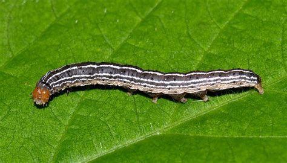
    
Figura 1: Exemplo de lagarta de soja.

 
 
 

A figura 2 representa um exemplo de _Percevejo marrom_

    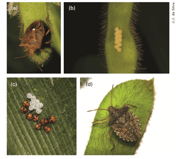
    
Figura 2: Exemplo de percevejo marrom.

 
 
 

A figura 3 denota um exemplo de _Percevejo pequeno_

    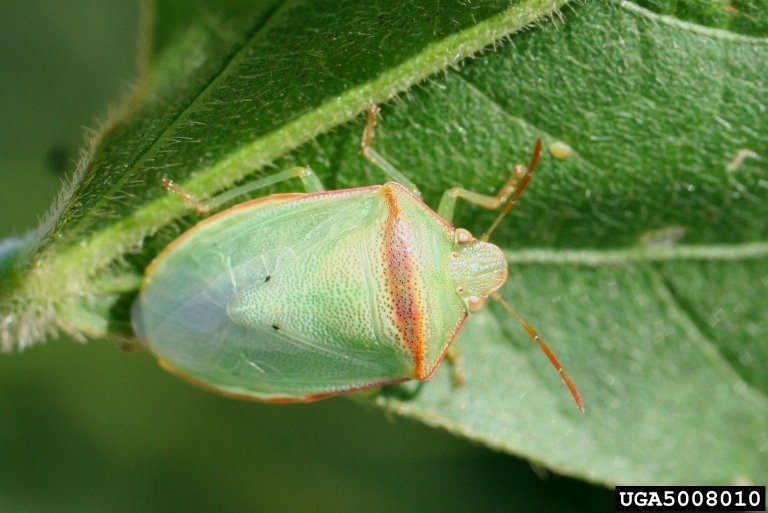
    
Figura 3: Exemplo de percevejo pequeno.

 
 
 

A figura 4 constitui um exemplo de _Percevejo verde_

    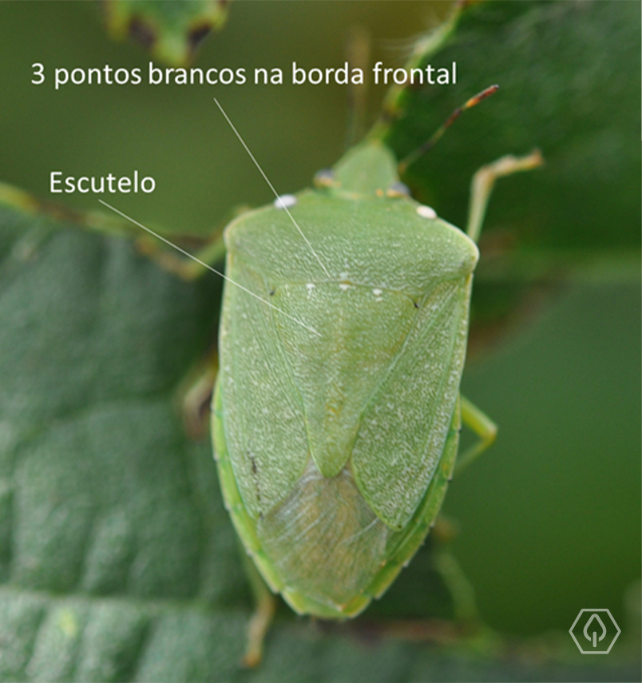
    
Figura 4: Exemplo de percevejo verde.

 
 
 

A essa altura você já deve ter percebido a intensa similaridade entre os percevejos e a figura 5 busca fornecer um pequeno guia em como diferenciá-los.

    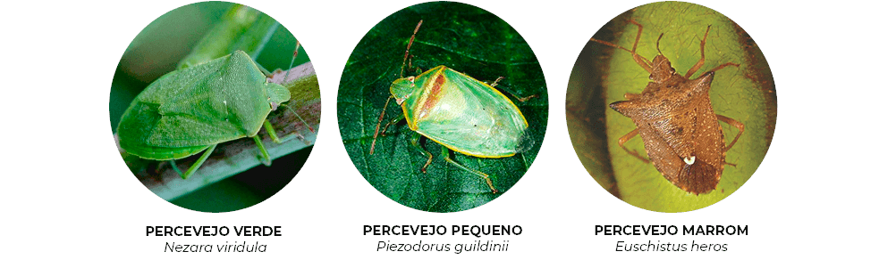
    
Figura 5: Comparativo entre os percevejos.

 
 
 

<!-- O objetivo deste desafio é criar um sistema automático de identificação das pragas que atigem a lavoura de soja citadas acima. Para esse desafio aconselhamos que o participante utilize o _IBM Watson Visual Recognition_ e monte o seu classificador através dele. Antes o participante terá que separar manualmente as imagens da base nas classes citadas anteriormente. Caso considere pertinente, cada participante pode manipular as imagens da base previamente afim de melhorar a acurácia de classificação do modelo do Watson Visual Recognition. -->

Cada participante deve considerar quatro classes em seu modelo, sendo elas:

- `lagarta` -> representando a lagarta de soja
- `percevejo_marrom` -> representando o pervejo marrom
- `percevejo_pequeno` -> repressantando o percevejo pequeno
- `percevejo_verde` -> representnado o percevejo verde

Veja o vídeo abaixo de como treinar o seu modelo de Visual Recognition, usando Watson Studio.

    

## 5. Submissão

Para submeter sua solução é necessário subir a aplicação de submissão na IBM Cloud, você deve **clicar no botão abaixo**, que irá ativar a ferramenta de _Continuous Delivery_ da IBM Cloud (também conhecida como _Delivery Pipeline_). A ferramenta irá pedir suas credenciais, seu e-mail, e uma senha, que você deve escolher para utilizar futuramente.

<b>🚨 CLIQUE PARA SUBIR A APLICAÇÃO NA IBM CLOUD 🚨</b>

### 5.1. Credenciais do Visual Recognition

🚨 **SALVE AS CREDENCIAIS. VOCÊ IRÁ PRECISAR PARA SUBIR A APLICAÇÃO** 🚨

Para pegar o `IAM_APIKEY` (ou, em alguns casos, `API Key` apenas) e a `URL` do Visual Recognition, acesse o https://cloud.ibm.com/resources e veja na lista de `Service`, você encontrará todos os serviços provisionados na sua conta.

    <h2><b>Visual Recognition</b></h2>
    <h3><b>IAM_APIKEY do Visual Recognition na IBM Cloud</b></h3>
    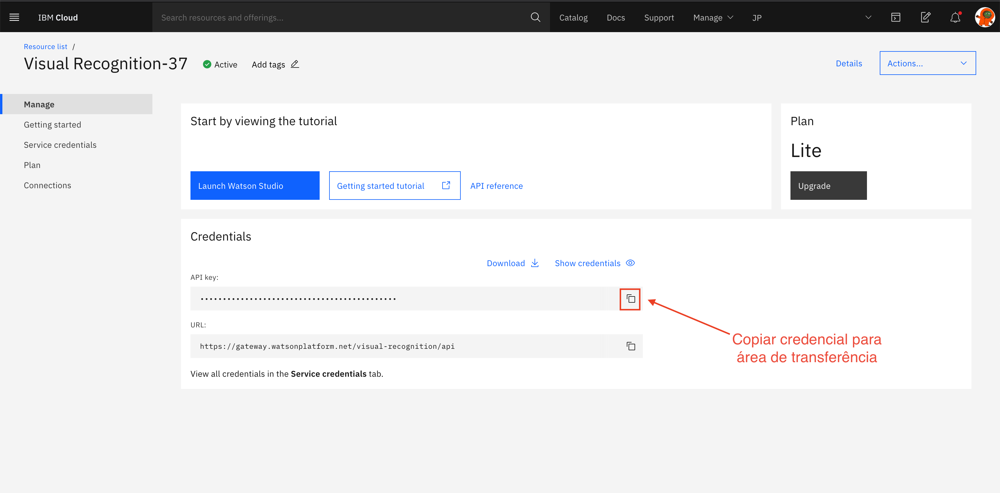
    <h3><b>URL do Visual Recognition na IBM Cloud</b></h3>
    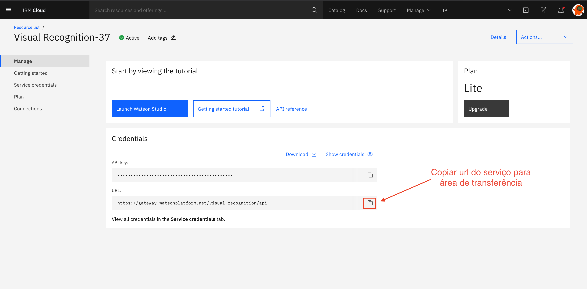
    <h3><b>CLASSIFIER_ID no Watson Studio</b></h3>
    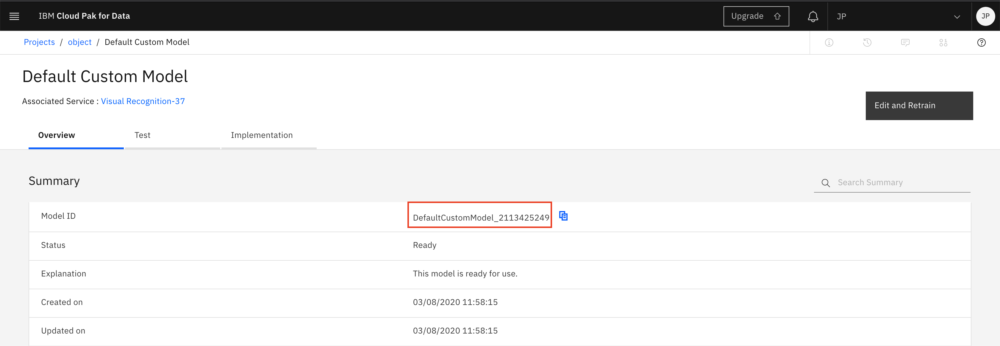

Ao final do processo você terá uma aplicação para testar seu modelo de reconhecimento visual e a submissão do seu desafio será feita através dela. São permitidas apenas três submissões. Veja o vídeo acima para saber onde pegar a url da aplicação.

    <h3><b>Aplicação de submissão</b></h3>
    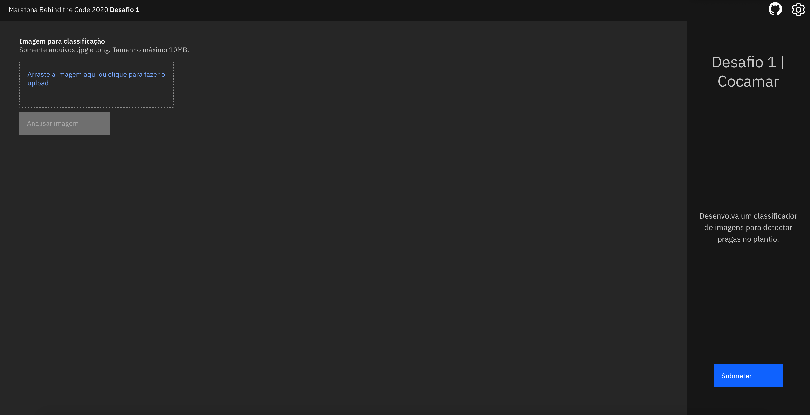
    <h3><b>Clique em submeter</b></h3>
    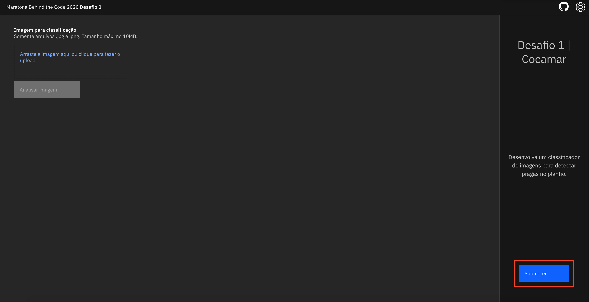
    <h3><b>Digite sua senha e submeta</b></h3>
    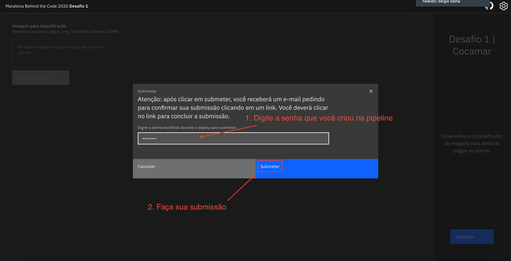

## 6. Sobre Avaliação

O sistema testará o reconhecimento das quatro classes citadas acima, ou seja, seu classificador deve reconhecer as classes `lagarta`, `percevejo_marrom`, `percevejo_pequeno` e `percevejo_verde`. Sua pontuação será baseada em quantas imagens seu modelo reconheceu corretamente e na certeza que ele tem nesse reconhecimento. Portanto teste bastante o seu modelo e utilize imagens de qualidade como exemplo, sem muito ruído e com foco no que deve ser reconhecido.

## 7. Especificações técnicas

Para a resolução do desafio, você irá utilizar o serviço de [Visual Recognition](https://cloud.ibm.com/catalog/services/visual-recognition) no plano Lite. Nesse plano, existe um limite de 1000 eventos por mês, em que cada evento corresponde, por exemplo, a uma imagem durante o treinamento, ou à classificação de uma imagem. Portanto, tome cuidado ao usar muitas imagens e treinar muitas vezes para não estrapolar o limite do plano, o que invalidaria seu modelo para submissão. Deixe uma margem de pelo menos 100 eventos para que seu modelo possa ser avaliado com sucesso.

_Exemplo: Um usuário estrapola o limite do plano Lite criando 4 classes com 250 imagens cada e treinando o modelo, pois 4 \* 250 = 1000._

## Material de apoio

- [O que é a IBM Cloud e como subir a sua primeira aplicação na nuvem](https://medium.com/ibmdeveloperbr/o-que-%C3%A9-a-ibm-cloud-e-como-subir-a-sua-primeira-aplica%C3%A7%C3%A3o-na-nuvem-41bfd260a2b7?source=friends_link&sk=7944d2fe14aa940e9bade68ce0731ba0)

## Em caso de dúvidas

Caso o vídeo publicado acima não seja suficiente, você pode analisar a documentação oficial do serviço envolvido no desafio:

- [IBM Watson Visual Recognition]()

Você também pode acessar o discord oficial da Maratona 2020 para realizar perguntas e/ou interagir com outros participantes: [Discord](https://discord.gg/2NRPpcU).

## License

Copyright 2019 Maratona Behind the Code

Licensed under the Apache License, Version 2.0 (the "License");
you may not use this file except in compliance with the License.
You may obtain a copy of the License at

       http://www.apache.org/licenses/LICENSE-2.0

Unless required by applicable law or agreed to in writing, software
distributed under the License is distributed on an "AS IS" BASIS,
WITHOUT WARRANTIES OR CONDITIONS OF ANY KIND, either express or implied.
See the License for the specific language governing permissions and
limitations under the License.
